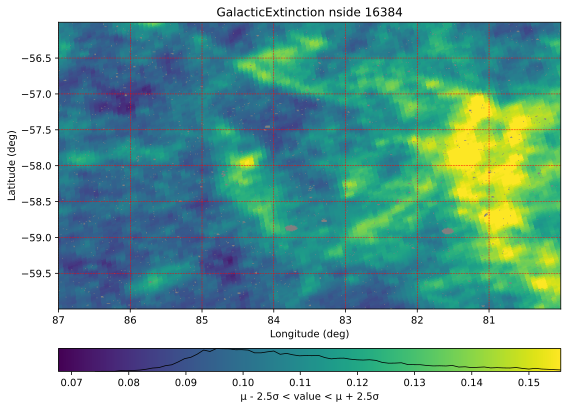
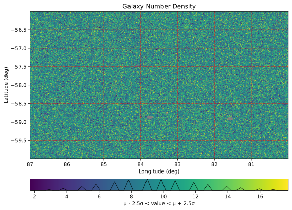

Module decontamination.plotting
===============================

Plotting in the HEALPix space
-----------------------------

.. raw:: html

    

.. raw:: html

    

.. automodule:: decontamination.plotting.healpix_map
   :members:

Plotting in the latent space
----------------------------

.. raw:: html

    

.. image:: _html_static/plotting-3.svg
  :alt: Plotting 3
  :width: 85%
  :align: center

.. image:: _html_static/plotting-4.svg
  :alt: Plotting 4
  :width: 85%
  :align: center

.. raw:: html

    

.. automodule:: decontamination.plotting.latent_space
   :members:

Utilities
---------

.. automodule:: decontamination.plotting
   :members:
